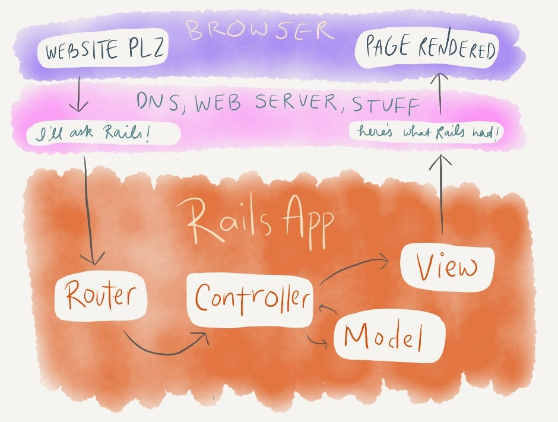

### 當輸入網址後網頁會是怎樣顯示的呢？這裡是一個概括的總覽。

1. 使用者輸入一個網址，希望是一個很酷的網站。
1. DNS 會解析這個網址（以後會另闢新文講解這件事），然後要求被丟到網站伺服器去並且跟 Rails 說它得到了什麼東西。
1. Rails 開始進入路由檔案，並且找到跟網址相對應的 controller 以及 action 。
1. controller 會開始處理，並且透過相關的 model 從資料庫中撈取需要的資訊。
1. controller 從 model 拉回來的資料會透過 view 來建立一些 HTML 。
1. Rails 將這些資料打包起來後回應給網站伺服器。
1. 網站伺服器將回應送回到瀏覽器上，顯示出一個很酷的網站給使用者。